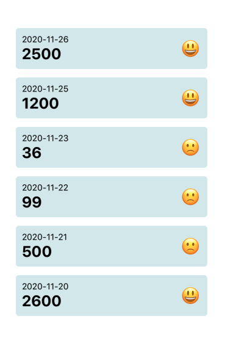

# React Native Health App
This project integrates with Apple HealthKit on iOS and Google Fit on android. And shows the last 7 days of steps.



## Enable Google Fitness API for your application (Android)
Make sure Google Fit app is preinstalled on your device.

In order for your app to communicate properly with the Google Fitness API you need to enable Google Fit API in your Google API Console.
Also you need to generate new client ID for your app and provide both debug and release SHA keys.
Another step is to configure the consent screen, etc.

More detailed info available at
https://developers.google.com/fit/android/get-api-key

## Running the project

- Clone this project
```
git clone https://github.com/riseworld27/rn-health.git
```

- Install dependencies
```
yarn
```

- Run packager
```
yarn start
```

- Run iOS
```
yarn ios
```

- Run Android
```
yarn android
```
